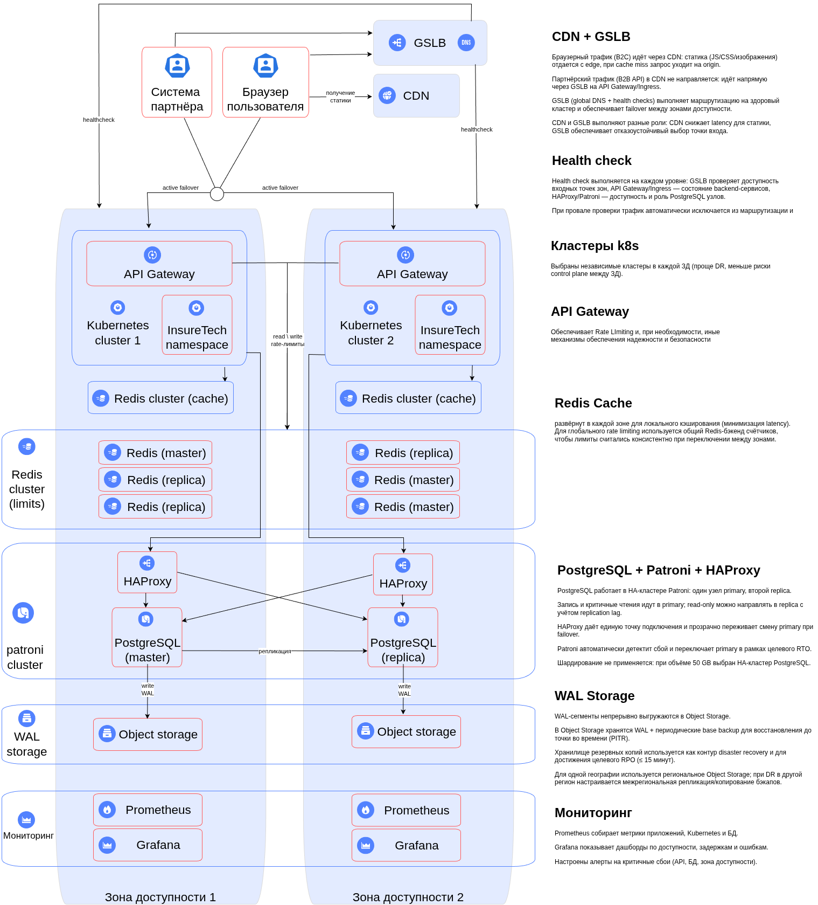

# Задание 1

Итоговая технологическая схема (to-be): **`InsureTech_технологическая_архитектура-to-be.drawio.xml`**. Детали — на диаграмме (ЗД, GSLB/CDN, кластеры K8s, БД, RTO/RPO, без шардирования при 50 GB).

