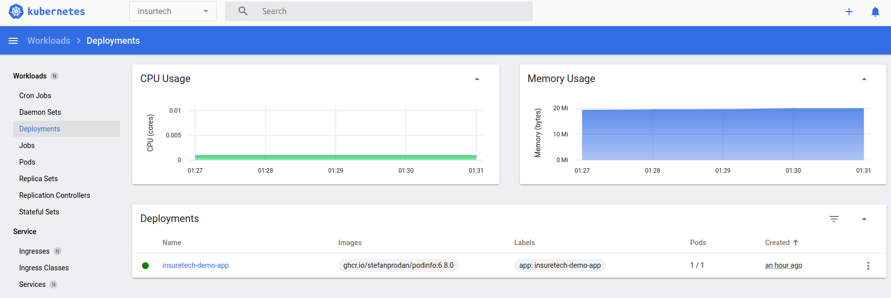
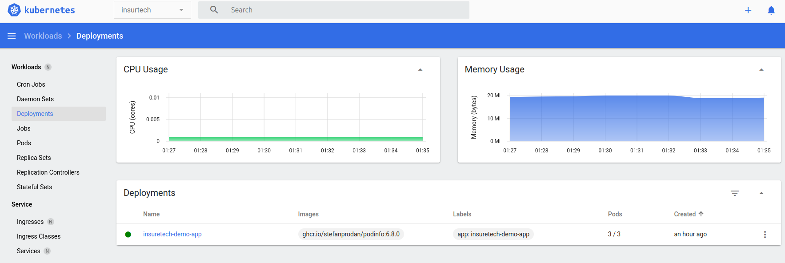
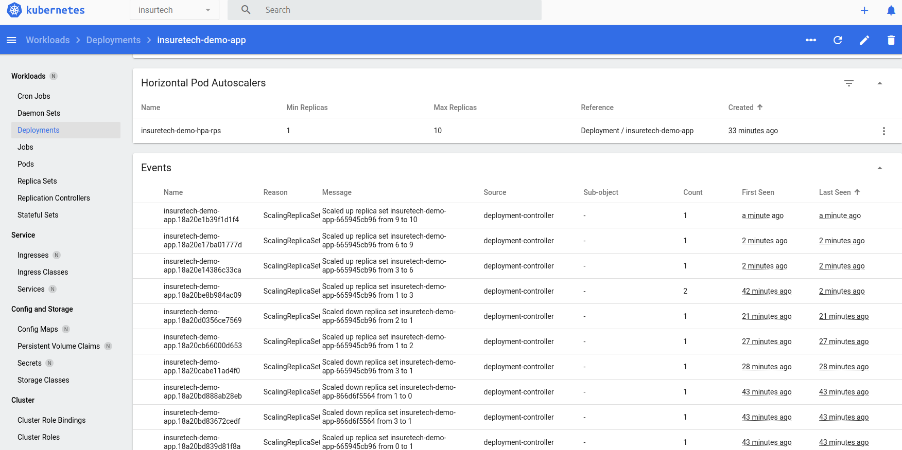
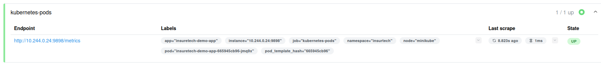
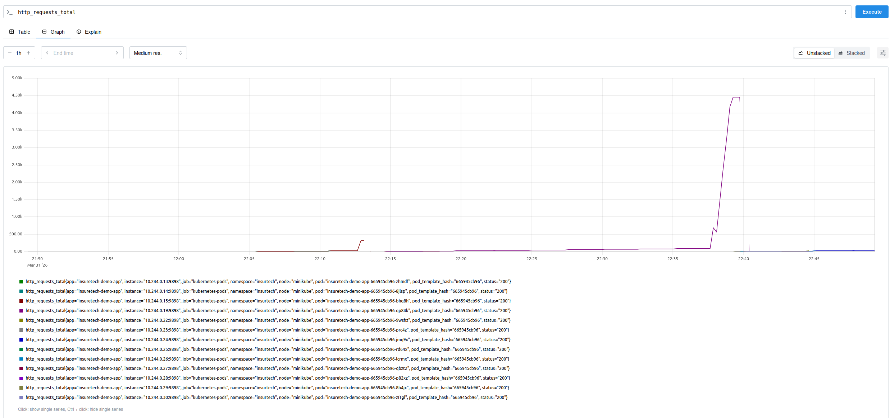

# Задание 2 — динамическое масштабирование

**Окружение:** Minikube. **Namespace:** `insurtech`.

**Ресурсы:** Deployment `insuretech-demo-app`, Service `insuretech-demo-svc` (порт 8080 → контейнер 9898). Манифесты: [`k8s/`](k8s/).

---

## Часть 1 — HPA по памяти

Манифесты: [`k8s/deployment.yaml`](k8s/deployment.yaml), [`k8s/service.yaml`](k8s/service.yaml), [`k8s/hpa-memory.yaml`](k8s/hpa-memory.yaml).

**Dashboard (масштабирование и события):**

| Без нагрузки (1 pod) | 3 pods | 10 pods |
|----------------------|--------|---------|
|  |  |  |

**События Deployment (scale up / scale down):**

---

## Часть 2 — Prometheus и HPA по RPS

Установка: Helm, namespace `monitoring`. Values: [`helm/prometheus-values.yaml`](helm/prometheus-values.yaml), [`helm/prometheus-adapter-values.yaml`](helm/prometheus-adapter-values.yaml). HPA: [`k8s/hpa-rps.yaml`](k8s/hpa-rps.yaml).

**Prometheus UI:**

| Targets | Graph, запрос `http_requests_total` |
|---------|-------------------------------------|
|  |  |

---

## Остальные материалы

- Нагрузка: [`locust/locustfile.py`](locust/locustfile.py)
- Логи и выгрузки: [`evidence/part1/`](evidence/part1/), [`evidence/part2/`](evidence/part2/)
