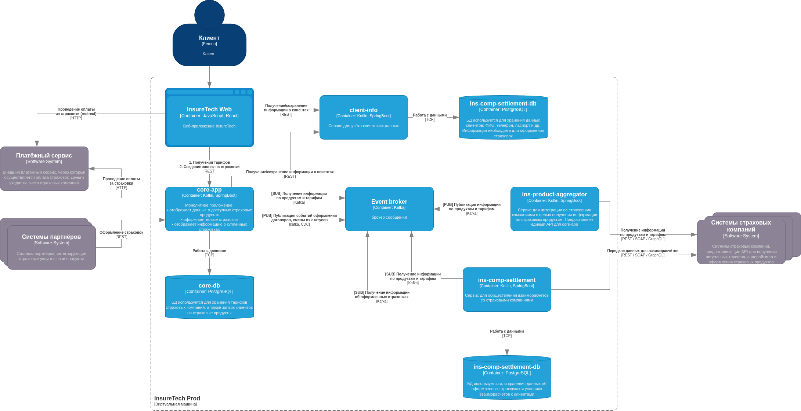

# Task 3 — решение

## Проблемы и риски при росте нагрузки

- Синхронные цепочки `core-app` / `ins-comp-settlement` → `ins-product-aggregator` → N страховых: рост N и RPS увеличивает задержки, таймауты и долю частичных сбоев.
- Один запрос к агрегатору размножается во внешние вызовы — узкое место и риск «забить» интеграции при пиках.
- Polling (15 мин / сутки) не даёт предсказуемой актуальности реплик между сервисами при частых изменениях каталога/тарифов.
- Суточный REST `ins-comp-settlement` → `core-app` для реестра полисов: при сбоях — повторы, дубли, пропуски или ручная доработка.
- Нагрузка на агрегатор и на сервисы, которые стоят «ниже» него по цепочке вызовов, не развязывается: масштабирование HTTP не снимает каскадные отказы.

## Целевое решение

- Внутренний обмен каталогом/тарифами и фактами оформления полисов — через **event streaming** (брокер, например Kafka-compatible): производители пишут события после фиксации данных; потребители обновляют локальные read-модели и снимают суточный опрос `core-app`.
- Интеграции со страховыми (`REST/SOAP/GraphQL`) остаются на границе `ins-product-aggregator` и `ins-comp-settlement`; пользовательский контур (`InsureTech Web` → `core-app`) по смыслу не меняется.

**Про актуальность тарифов/продуктов и расписания.** Раньше `core-app` и `ins-comp-settlement` подтягивали каталог **с разной периодичностью** (условно раз в 15 минут и раз в сутки), из‑за чего реплики могли расходиться. В event-driven модели оба сервиса получают **одну и ту же последовательность событий** из брокера — проще не «разъезжаться» по версиям данных **между собой**, чем при независимом polling. Расписание **опроса партнёров** (страховых) логично сосредоточить в `ins-product-aggregator` и настраивать **отдельно** от старых таймеров в потребителях: частоту можно увеличивать или снижать под бизнес и квоты API.

С оговорками: **свежесть данных у партнёров** по-прежнему ограничена тем, как часто агрегатор реально ходит к страховым; брокер сам по себе не ускоряет внешние интеграции. Частый опрос — это нагрузка на контрагентов и на resilience-политики. Кроме того, расхождение между `core-app` и `ins-comp-settlement` всё ещё возможно при **отставании консьюмеров**, сбоях обработки или длительном простое — без мониторинга lag это не исчезает. Итого тезис «регулярно для всех и расписание как захотим» верен в части **единого потока изменений и независимой настройки цикла синхронизации с партнёрами**, но **не** означает произвольную свежесть без учёта лимитов страховых и здоровья очередей.

## Потоки в брокере

По схеме в Kafka **публикуют** `ins-product-aggregator` (каталог/тарифы) и `core-app` (события по договорам); **читают** `core-app` и `ins-comp-settlement`.

**Про Transactional Outbox — не везде.** Это отдельная таблица/процесс и усложнение эксплуатации; имеет смысл там, где **недопустимо** долго или необратимо «потерять» факт публикации относительно уже зафиксированных в БД данных.

- **Продукты и тарифы (`ins-product-aggregator`):** данные собираются при обращении к системам страховых, затем **публикуются в Kafka** отдельным шагом. На схеме у агрегатора отдельной БД нет — при сбое отправки в брокер можно **повторить публикацию** на следующем цикле синхронизации или отдельным ретраем, опираясь на свежий результат опроса страховых; потребители остаются **идемпотентными** (`version`, `eventId`). **Transactional outbox** здесь не обязателен: проще сопровождение, в обмен на возможные кратковременные отставание реплик и дубли при at-least-once.

- **Оформленные договоры (`core-app` → settlement):** для взаиморасчётов важно не «забыть» факт выдачи относительно записи в `core-db`. Здесь уместны **transactional outbox** (запись в outbox в той же транзакции, что и полис) **или** **CDC** с таблицы полисов — оба варианта дают предсказуемую связку «строка в БД → попытка доставки в брокер» без опоры на «перезапросим когда-нибудь».

| Топик (пример) | Что в сообщении | Публикует | Потребляет | Публикация в Kafka |
|----------------|-----------------|-----------|------------|-------------------|
| `product-catalog-events` / `tariff-events` | изменения каталога и тарифов | `ins-product-aggregator` | `core-app`, `ins-comp-settlement` | **Без обязательного outbox:** публикация с **ретраями** после синхронизации со страховыми; идемпотентные потребители. |
| `policy-issued-events` | факт выдачи полиса | `core-app` | `ins-comp-settlement` | **Outbox или CDC** — выше цена потери события для учёта. |
| *(опционально)* `policy-status-events` | смена статуса | `core-app` | по необходимости | Как для полисов, если статус нужен ещё кому-то кроме уже описанных подписчиков; иначе топик не вводим. |

**Про `ins-comp-settlement`:** только **консьюмер** — outbox не применяется.

## Прочие архитектурные замечания

- **Доставка:** как минимум at-least-once → у потребителей **идемпотентность** по `eventId` или `(aggregateId, version)`; повторы допустимы.
- **Порядок:** ключ партиции `productId` / `tariffId` / `policyId`, чтобы события одной сущности шли упорядоченно в рамках партиции.
- **Ошибки обработки:** отдельная **DLQ** или мёртвая очередь + алерты; ретраи с backoff, без бесконечного блокирования consumer group.
- **Схема сообщений:** зафиксировать контракт (JSON Schema / Avro + реестр схем), совместимость при эволюции полей.
- **Наблюдаемость:** lag по consumer group, rate ошибок, размер DLQ — в тех же принципах, что и целевая платформа из Task1 (метрики/алертинг).

## Resilience-паттерны

**Исходящие вызовы в системы страховых** (`ins-product-aggregator`, `ins-comp-settlement`):

| Паттерн | Зачем здесь |
|--------|-------------|
| **Timeout** | Жёсткий верхний предел ожидания ответа; без него один медленный контрагент блокирует рабочие потоки надолго. |
| **Bulkhead** | Отдельные лимиты параллелизма / пулы (или очереди с cap) **на страховую компанию** (или на группы API), чтобы сбой или деградация одной не выжигали ресурсы под всех. |
| **Circuit breaker** | При серии ошибок временно перестать долбить недоступный endpoint, дать системе отдышаться и не усугублять каскад. |
| **Retry с backoff + jitter** | Только для **идемпотентных** запросов и с ограничением попыток; для неидемпотентных — отдельная политика или ручной/отложенный повтор. |
| **Rate limiting (per insurer / per client)** | Согласование с контрагентами по RPS и защита своих квот; перегруз со стороны одной страховой не должен «съедать» лимит целиком без учёта по контрагентам. |

**Синхронный вход в `core-app` (веб, B2B):** лимиты и очереди по партнёрам/каналам (в духе уже описанного в продукте перегруза одним партнёром) — отдельный **bulkhead** по типу клиента или API-ключу, чтобы B2B не вытеснял B2C и наоборот.

**Брокер и консьюмеры:** помимо DLQ/ретраев — контроль **lag**, при необходимости **уменьшение параллелизма** обработки по тяжёлым топикам; **graceful degradation** на чтении (например, отдавать пользователю данные из локальной реплики с понятной меткой устаревания, если поток отстаёт — только если бизнес допускает).

**Связка с Event-Driven:** внутренние сервисы меньше зависят от синхронной доступности друг друга; устойчивость смещается к **качеству исходящих интеграций**, **обработке сообщений** и **наблюдаемости**, а не к бесконечным цепочкам HTTP внутри контура.

## Артефакты

### Диаграмма контейнеров (to-be)

*Рис. 1. Контейнерная модель C4: брокер событий (Kafka), потоки PUB/SUB и внешние системы.*

- Исходник draw.io: `InsureTech_C4_container-diagram-to-be.drawio.xml`
- Экспорт для просмотра: `to-be.png` (см. рисунок выше)
- Исходная схема для сравнения: `context/InsureTech_C4_container-diagram.drawio.xml`
