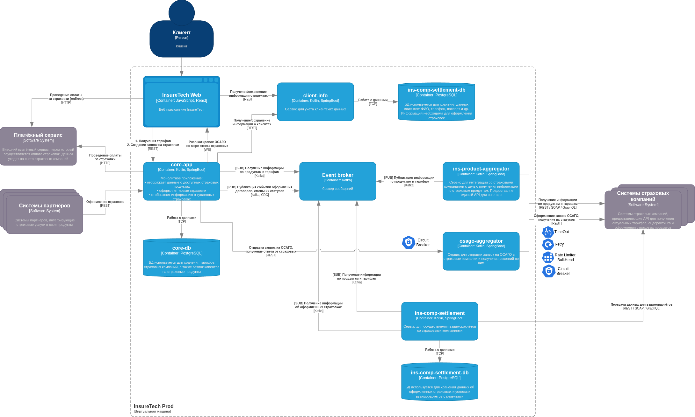

# Task 4 — ОСАГО онлайн: решение

## Задача

Пользователь заполняет данные по авто; сервис опрашивает всех доступных страховых; на экране предложения появляются по мере готовности; на одну страховую не больше **60 с** ожидания; в пик до **~2500** одновременных сценариев создания заявки. Оформление продукта и API для веба — в **`core-app`**; обращения к страховым по ОСАГО — в **`osago-aggregator`**.

## Почему без Kafka для контура ОСАГО

Ответ по котировке нужен **быстро**, в том же пользовательском сценарии. Прокидывать шаги через брокер добавляет задержку и операционную сложность (очереди, лаг, повторная обработка) там, где выгода не в том, чтобы «отложить на потом», а в том, чтобы **сразу** получить результат и отдать его клиенту.

Для ОСАГО выбрано **синхронное взаимодействие** `core-app` ↔ `osago-aggregator` (REST): старт расчёта, запрос статуса/результата по сессии. **Kafka** в архитектуре остаётся для контуров из задания 3 (каталог, полисы, события по договорам) и с этим контурами не смешивается.

## Разные модели API у страховых

В реальности API ОСАГО у контрагентов устроены по-разному: где-то ответ приходит **в одном синхронном вызове**, где-то после **создания заявки** нужен **polling** второго эндпоинта, пока не готово предложение.

Роль **`osago-aggregator`** — **свести это к одному внутреннему контракту** для `core-app`: внутри сервиса — адаптеры «под страховую» (синхронный вызов или цикл опроса с интервалом и таймаутом **60 с**), снаружи — единое поведение «заявка создана → по мере готовности приходят ответы по каждой страховой». Так `core-app` не зависит от того, синхрон у конкретного партнёра или асинхрон с опросом.

## Надёжность

- **Timeout** на каждый вызов к API страховой (и на цикл polling, если он есть), с верхней границей по ТЗ **60 с** на получение предложения от одной страховой.
- **Retry** — только для **идемпотентных** шагов (повтор запроса статуса/предложения с тем же идентификатором заявки), с ограничением попыток и backoff, чтобы не дублировать оформление.
- **Rate limiting** и **bulkhead**: отдельные лимиты **на страховую** (и при необходимости на сессию пользователя), чтобы одна деградирующая интеграция или пик по одному контрагенту не выжигали общие пулы.
Паттерны показаны на схеме обозначениями из библиотеки курса.

### Circuit breaker: два места на схеме

На диаграмме **два** circuit breaker — это не дублирование одного и того же правила, а **разные границы отказа**.

1. **Между `core-app` и `osago-aggregator`.**  
   `core-app` вызывает aggregator по REST. Если aggregator начинает стабильно отвечать ошибками или не укладывается в приемлемое время, без breaker монолит будет снова и снова открывать синхронные вызовы: потоки и таймауты забираются **сразу на всех пользователей**, страдают не только ОСАГО, но и остальные сценарии. Breaker здесь даёт **быстрый отказ** «вниз по цепочке не сходим» и сохраняет ресурсы `core-app` для остального трафика.

2. **Между `osago-aggregator` и API страховых.**  
   Здесь классическое назначение breaker: **внешняя** система. Если у одной страховой лавина 5xx/таймаутов, повторные запросы не ускорят ответ и только **нагрузят** и нас, и контрагента. Breaker обычно вешают **per страховая** (или per endpoint): при срабатывании по одной страховой котировки по остальным продолжают приходить — это как раз сценарий «показывать предложения по мере готовности», а не заваливать весь экран из‑за одного недоступного партнёра.

Итог: первый breaker защищает **наш монолит** от деградации своего же агрегатора; второй — **исходящий контур** к страховым от бессмысленных повторов при их сбое.

## Масштабируемость

- **`core-app`** и **`osago-aggregator`** крутятся **в нескольких экземплярах** (как в Kubernetes): горизонтальное масштабирование за счёт реплик за балансировщиком.
- Состояние сессии расчёта и привязка внешних id заявок к внутренним хранятся **в базе** (отдельная БД или схема у aggregator’а / согласованное с `core-app` хранилище), а не в памяти одного пода, чтобы любой инстанс мог продолжить работу после перезапуска.
- Для **WebSocket** при нескольких подах `core-app` нужны **sticky sessions** на ingress или общее хранилище сессий — иначе клиент может потерять канал при смене пода.

## Интеграции (кратко)

| Участок | Средство |
|--------|----------|
| Веб ↔ `core-app` | REST для команд сценария; для потока котировок — **WebSocket** (на схеме — WS), отдельно от REST. |
| `core-app` ↔ `osago-aggregator` | **REST**, без Kafka для этого контура. |
| `osago-aggregator` ↔ страховые | **REST** по ТЗ (два эндпоинта); внутри — учёт синхронного и polling-режимов. |

## Диаграмма (to-be)

*Рис. 1. Контейнерная модель C4 (to-be): `osago-aggregator`, REST и WebSocket к веб-клиенту, Kafka для контуров задания 3, паттерны устойчивости на границах.*

- Исходник: `to-be-diagram.drawio`
- Экспорт для просмотра и PR: `to-be.png`

## Итог для ревьюера

| Вопрос | Ответ |
|--------|--------|
| Хранилище у `osago-aggregator` | Нужно для id заявок, статусов и идемпотентности при репликах — на схеме цилиндр БД или пояснение, где именно хранится состояние. |
| Kafka для ОСАГО | Нет, осознанно: см. раздел выше. |
| Разные API страховых | Нормализуются внутри `osago-aggregator`. |
| Паттерны | Timeout, Retry, Rate limiting, Bulkhead, Circuit breaker — на схеме по библиотеке; два circuit breaker — см. раздел выше. |

Актуальные подписи на стрелках и наличие всех паттернов на диаграмме — **источник истины** для согласования с этим текстом.
